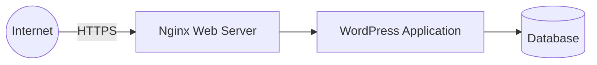
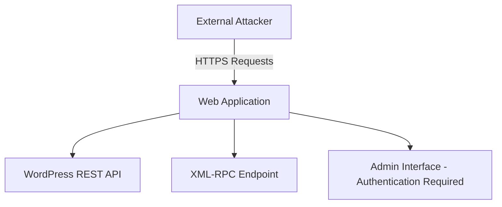

# 🔐 External Web Application VAPT
### Public Case Study (Sanitized)

> **Engagement Type:** External Web Application Vulnerability Assessment & Penetration Testing (VAPT)  
> **Target:** Production WordPress Web Application (Sanitized)  
> **Approach:** Gray-box  
> **Status:** Completed  
> **Disclosure:** All sensitive details removed

---

## 📌 Overview

This repository documents a **real-world external Vulnerability Assessment & Penetration Testing (VAPT)** engagement conducted against a live WordPress-based web application. The objective was to assess the application's security posture from an external attacker's perspective, identify realistic risks, and provide actionable remediation guidance—**without disrupting production systems**.

This case study reflects **professional consulting methodology**, not lab-based testing or simulated exercises.

---

## 🎯 Scope & Constraints

### In Scope
- Public-facing web application
- WordPress application layer
- HTTP/TLS configuration
- Publicly accessible endpoints

### Out of Scope
- Denial-of-Service (DoS) testing
- Brute-force authentication attacks
- Social engineering
- Data modification or data exfiltration

All testing activities were conducted with **explicit authorization** and within clearly defined boundaries.

---

## 🧭 Methodology

The engagement followed a structured, phased approach aligned with industry best practices:

1. Reconnaissance & attack surface mapping
2. Threat modeling based on realistic attacker behavior
3. Automated vulnerability assessment (controlled)
4. Manual validation of findings
5. Limited, non-destructive proof-of-concept testing
6. Risk-rated reporting & remediation guidance

The emphasis throughout the engagement was **signal over noise**, prioritizing accuracy and impact over volume.

---

## 🗺️ High-Level Architecture

**Architecture Notes**
* Single externally exposed web server
* No CDN or WAF in front at the time of testing
* TLS enforced end-to-end

---

## 🎯 Attack Surface Overview

**Observed Exposure**
* Public REST API endpoints
* XML-RPC endpoint accessible
* Administrative interfaces properly restricted

---

## 🔍 Key Findings (Sanitized)

### 🟠 Medium-Risk Findings

**1. XML-RPC Endpoint Exposure**
* XML-RPC endpoint was publicly accessible
* Requests were processed without authentication
* Increases attack surface (historically abused vector)

**2. User Enumeration via Public Endpoints**
* Valid usernames disclosed via public WordPress endpoints
* Enables targeted authentication attacks when combined with other weaknesses

---

### 🟡 Low-Risk Findings

* Outdated WordPress theme (minor version lag)
* Missing recommended HTTP security headers

---

### ✅ Positive Security Observations

* WordPress core fully up to date
* No third-party plugins detected (reduced attack surface)
* Strong TLS configuration (TLS 1.3, modern cipher suites)
* Administrative interfaces properly restricted

---

## 📊 Risk Summary

| Severity | Count   |
|----------|---------|
| Medium   | 2       |
| Low      | 2       |
| Info     | Several |

No critical vulnerabilities or evidence of compromise were identified during the engagement.

---

## 🛠️ Remediation Highlights

Recommended remediation actions focused on:

* Restricting or disabling XML-RPC where not required
* Preventing user enumeration via public endpoints
* Updating WordPress themes promptly
* Implementing browser-side security headers (HSTS, CSP, etc.)

These represent **low-cost, high-impact** security improvements.

---

## 📸 Evidence Screenshots (Sanitized)

> Screenshots are sanitized to remove sensitive details and identifiers.

* XML-RPC endpoint response validation
* Username enumeration via public endpoints
* HTTP security header inspection

See the `/screenshots` directory for placeholders and descriptions.

---

## 📚 Lessons Learned

### 1. Strong Defaults Matter
Keeping core components up to date and minimizing third-party dependencies significantly reduces real-world risk.

### 2. Exposure Does Not Equal Exploitation
Not every exposed feature is exploitable. Accurate assessment requires understanding **how attackers realistically chain behaviors**.

### 3. Manual Validation Is Essential
Automated tools provided useful signals, but manual testing was critical to:
* Eliminate false positives
* Correctly rate risk
* Avoid overstating impact

### 4. Reporting Is a Security Skill
Clear, honest reporting builds trust. Security value comes from **prioritization**, not the number of findings.

### 5. Defense-in-Depth Wins
Layered controls—such as endpoint restriction, configuration hardening, and browser protections—meaningfully improve resilience over time.

---

## 🔚 Closing

This case study demonstrates a **complete, real-world external VAPT workflow** executed against a production system under controlled conditions.

Future case studies will explore:
* Web application logic vulnerabilities
* Cloud-exposed services
* Incident-driven threat analysis

---

## 📬 Contact

If you'd like to discuss this case study, collaborate on security work, or explore similar engagements:

* **LinkedIn:** (add your profile link)
* **Email:** (add professional email)
* **Portfolio:** (optional personal site / GitHub profile)

---

*This repository is intended for professional demonstration purposes only. No sensitive system details are disclosed.*
