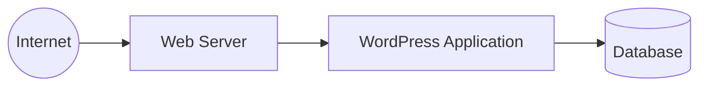
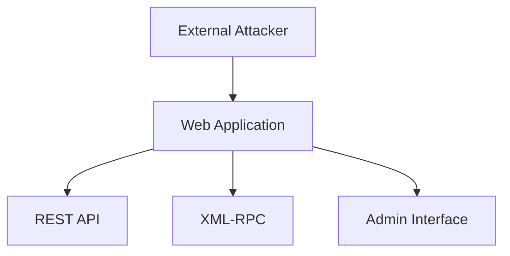

# 🔐 External Web Application VAPT  
### Public Case Study (Sanitized)

> **Type:** External Web Application VAPT  
> **Target:** Production WordPress Application (Sanitized)  
> **Approach:** Gray-box  
> **Status:** Completed  

---

## Overview

This repository documents a **real-world external Vulnerability Assessment & Penetration Testing (VAPT)** engagement conducted against a live WordPress-based web application.

The goal was to evaluate the application's external security posture, identify realistic risks, and provide actionable remediation guidance — **without disrupting production systems**.

This is a sanitized case study intended to demonstrate **professional VAPT methodology and judgment**, not exploit development.

---

## Scope (High-Level)

**In scope**
- Public-facing web application
- WordPress application layer
- HTTP/TLS configuration
- Public endpoints

**Out of scope**
- Denial-of-Service (DoS)
- Brute-force authentication
- Social engineering
- Data modification or exfiltration

---

## Methodology (Summary)

Testing followed a structured, phased approach:

- Reconnaissance & attack surface mapping  
- Threat modeling  
- Controlled automated assessment  
- Manual validation  
- Limited, non-destructive proof-of-concept testing  
- Risk-rated reporting  

Detailed methodology is documented separately.

📘 **See:** `docs/methodology.md`

---

## Architecture Overview


---

## Attack Surface Overview


---

## Key Findings (Summary)

### 🟠 Medium Risk
- XML-RPC endpoint publicly accessible
- User enumeration via public WordPress endpoints

### 🟡 Low Risk
- Outdated WordPress theme
- Missing recommended HTTP security headers

### ✅ Positive Observations
- WordPress core fully up to date
- No third-party plugins detected
- Strong TLS configuration (TLS 1.3)
- Administrative interfaces properly restricted

Full findings and analysis are documented separately.

📘 **See:** `docs/findings.md`

---

## Remediation

Recommended actions focused on:

- Reducing unnecessary exposure (XML-RPC)
- Preventing user enumeration
- Maintaining component updates
- Improving browser-side security controls

📘 **See:** `docs/remediation.md`

---

## Lessons Learned

Reflections and technical takeaways from this engagement are documented separately.

📘 **See:** `docs/lessons-learned.md`

---

## Contact

- **LinkedIn:** https://linkedin.com/in/emmanuelajayi241
- **Email:** ajayiemmy241@gmail.com

---

*This repository is for professional demonstration purposes only. No sensitive system details are disclosed.*
```
